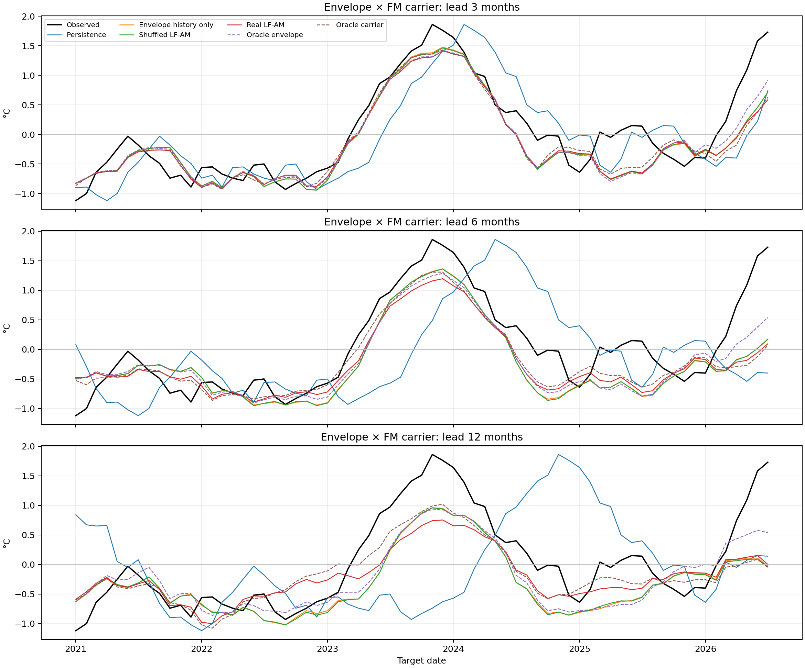
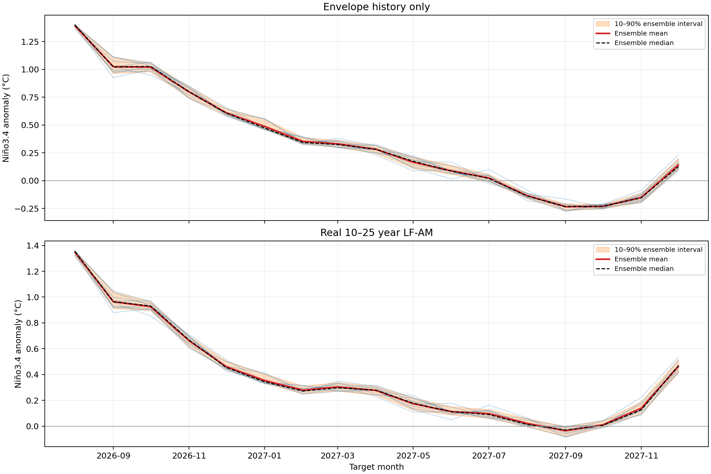

# Niño3.4 HHSA–XGBoost: Methods, Results, and Forecasts

## Executive summary

This project tests whether low-frequency amplitude modulation (AM) improves
ENSO prediction. The intended HHSA representation is

$$
IMF_k(t)=A_k(t)F_k(t),
$$

where A is the carrier envelope and F is a normalized FM carrier. The preferred
model forecasts A and F separately and then forces their product during
reconstruction. It does not treat AM as an arbitrary extra feature column.

All present scores are exploratory: HHSA was computed on the complete
1948–2026 record, so a causal expanding-window hindcast is still required.

## Data and saved products

Input data:

~~~text
data/nino34_monthly.npz
~~~

The record contains 943 monthly Niño3.4 anomalies from 1948-01 through
2026-07 at 12 samples/year.

Complete offline HHSA features:

~~~text
outputs/nino34_hhsa_features.npz
~~~

| Variable | Shape | Meaning |
|---|---:|---|
| date | (943,) | dates |
| nino34_anomaly_c | (943,) | original index |
| IMF | (943, 8) | first-layer carrier IMFs |
| fm | (943, 8) | carrier instantaneous frequency |
| am | (943, 8) | carrier envelope |
| IMF2 | (943, 6, 8) | second-layer envelope components |
| FM | (943, 6, 8) | second-layer instantaneous frequency |
| AM | (943, 6, 8) | second-layer component amplitude |

The implementation is the supplied masking-EMD/direct-quadrature HHSA port, not
PyEMD noise-ensemble EEMD.

## Main ENSO carrier and AM modes

After removing 24 months at each endpoint for diagnostics, the dominant
2–7-year carriers are:

| Mode | Period | ENSO-band energy fraction | Correlation with Niño3.4 |
|---:|---:|---:|---:|
| IMF_3 | 2.31 years | 97.0% | 0.607 |
| IMF_4 | 4.31 years | 98.7% | 0.663 |

The working ENSO component is therefore:

$$
N_{ENSO}(t)=IMF_3(t)+IMF_4(t).
$$

Dominant second-layer modulation periods are 9.66 and 18.03 years for IMF_3,
and 11.71 and 25.33 years for IMF_4. The longest 32–42-year components are
not primary ML inputs because only a few cycles are present.

## Common evaluation protocol

- Leads: 3, 6, and 12 months.
- Training targets through 2013-12.
- Validation: 2014-01 through 2020-12 (84 targets per lead).
- Test: 2021-01 through 2026-07 (67 targets per lead).
- Metrics: RMSE, ACC/Pearson correlation, and MSE skill against persistence.
- Monthly rows remain in chronological order; no random month split is used.

$$
Skill=1-\frac{MSE_{model}}{MSE_{persistence}}.
$$

## Experiment 1 — all HHSA arrays as ordinary tabular features

Code: src/hhsa/ml.py and examples/nino34_ml.py. Output: outputs/ml/.

This flattened all first- and second-layer arrays with lags and sent them to
XGBoost.

| Lead | XGB Raw RMSE / ACC | HHSA No-AM | HHSA All-AM |
|---:|---:|---:|---:|
| 3 | 0.477 / 0.821 | **0.291 / 0.957** | 0.361 / 0.944 |
| 6 | 0.678 / 0.588 | **0.475 / 0.878** | 0.572 / 0.875 |
| 12 | 0.842 / 0.300 | **0.598 / 0.753** | 0.663 / 0.689 |

This showed that HHSA information is useful, but adding every AM variable as a
normal column did not test the multiplicative hypothesis and was highly
over-parameterized.

## Experiment 2 — selected carrier and AM features

Output: outputs/ml_selected_am/.

The feature groups were Raw (15), Raw plus two ENSO carriers (23), carrier plus
first-layer envelope/frequency (39), and carrier plus four selected AM
components (87).

| Lead | XGB Raw | ENSO carrier | Carrier + envelope | Selected AM |
|---:|---:|---:|---:|---:|
| 3 RMSE | 0.477 | 0.468 | **0.468** | 0.495 |
| 3 ACC | 0.821 | 0.858 | **0.860** | 0.859 |
| 6 RMSE | 0.678 | **0.606** | 0.637 | 0.644 |
| 6 ACC | 0.588 | **0.739** | 0.713 | 0.671 |
| 12 RMSE | 0.842 | **0.582** | 0.632 | 0.658 |
| 12 ACC | 0.300 | **0.749** | 0.721 | 0.613 |

Carrier selection helped, but AM as ordinary columns still did not give a
robust increment.

## Experiment 3 — learned multiplicative AM gate

Code: src/hhsa/structured_ml.py and examples/nino34_structured_ml.py. Output:
outputs/ml_structured_hhsa/.

The model learned

$$
\hat A=\exp(\log\hat A_{\rm base}+\log\hat G_{\rm AM})
=\hat A_{\rm base}\hat G_{\rm AM},
$$

then multiplied by a predicted carrier. Controls were gate=1, shuffled AM, and
real AM.

| Lead | Gate=1 RMSE / ACC | Shuffled AM | Real AM |
|---:|---:|---:|---:|
| 3 | **0.555 / 0.878** | 0.556 / 0.882 | 0.583 / 0.859 |
| 6 | **0.624 / 0.810** | 0.636 / 0.791 | 0.674 / 0.758 |
| 12 | **0.631 / 0.769** | 0.653 / 0.744 | 0.651 / 0.733 |

This still asked XGBoost to guess a correction rather than forecast the HHSA
envelope itself.

## Experiment 4 — direct envelope × normalized FM carrier

This is the preferred implementation. Code: src/hhsa/envelope_ml.py and
examples/nino34_envelope_ml.py. Output: outputs/ml_envelope_multiply/.

For each carrier:

$$
A_k(t)=am[:,k],\qquad
F_k(t)=\frac{IMF_k(t)}{A_k(t)+\epsilon}.
$$

XGBoost separately predicts future envelope, normalized carrier, and residual.
Reconstruction is forced:

$$
\widehat{IMF}_k(t+h)=\hat A_k(t+h)\hat F_k(t+h),
$$

$$
\widehat{NINO3.4}
=\widehat{IMF}_3+\widehat{IMF}_4+\hat R.
$$

The AM comparison is:

- hhsa_no_lf_am: envelope history only;
- hhsa_shuffled_lf_am: LF-AM time correspondence shuffled during training;
- hhsa_real_lf_am: real 9.7–25.3-year LF-AM history.

### Test results

| Lead | No LF-AM RMSE / ACC | Shuffled LF-AM | Real LF-AM | Oracle envelope | Oracle carrier |
|---:|---:|---:|---:|---:|---:|
| 3 | **0.393 / 0.900** | 0.394 / 0.900 | 0.403 / 0.896 | 0.370 / 0.911 | 0.396 / 0.897 |
| 6 | 0.514 / 0.840 | 0.515 / 0.841 | **0.507 / 0.852** | 0.455 / 0.877 | 0.483 / 0.853 |
| 12 | 0.564 / 0.842 | 0.567 / 0.840 | **0.545 / 0.848** | 0.501 / 0.855 | 0.500 / 0.848 |

Real LF-AM gives a small test-set improvement at 6 and 12 months, but the
validation improvement is not consistent enough for a definitive AM claim.

## 2026 event

The observed 2026-07 Niño3.4 anomaly is 1.73°C.

| Lead | No LF-AM | Real LF-AM | Oracle envelope | Oracle carrier |
|---:|---:|---:|---:|---:|
| 3 | 0.713 | 0.587 | 0.915 | 0.631 |
| 6 | 0.167 | 0.095 | 0.540 | 0.070 |
| 12 | -0.021 | 0.001 | 0.540 | -0.052 |

The peak is strongly underestimated. The oracle comparison indicates that
future envelope growth, rather than the multiplication itself, is the main
bottleneck.

## Ten-member forecast through 2027-12

From the 2026-07 origin, 17 direct-horizon models forecast 2026-08 through
2027-12. Ten members use seeds 42–51.

Outputs:

~~~text
outputs/ml_envelope_multiply/ensemble_members_to_2027-12.csv
outputs/ml_envelope_multiply/ensemble_summary_to_2027-12.csv
outputs/ml_envelope_multiply/ensemble_forecast_to_2027-12.png
~~~

The real-LF-AM ensemble mean is 1.347°C in 2026-08, 0.462°C in 2026-12,
0.098°C in 2027-07, and 0.464°C in 2027-12. These are model/subsampling
members, not physical initial-condition ensembles, and the future segment has
not yet been observed.

## Reproduction and tests

~~~bash
PYTHONPATH=src python examples/nino34_envelope_ml.py
PYTHONPATH=src python examples/nino34_ensemble_forecast.py
PYTHONPATH=src python -m pytest -q
~~~

The current test result is 9 passed. Tests cover EMD reconstruction, HHSA
shapes, lag/lead alignment, chronological splitting, forward-only gate
residuals, envelope×carrier reconstruction, future-origin padding, and
ensemble output availability.

## Novelty assessment

HHSA's nested EMD/HHT AM–FM representation was established by
[Huang et al. (2016)](https://pmc.ncbi.nlm.nih.gov/articles/PMC4792412/).
Component-wise climate oscillation prediction using decomposition is also
established by
[Lee and Ouarda (2011)](https://agupubs.onlinelibrary.wiley.com/doi/full/10.1029/2010JD015142).
ENSO deep learning and transfer learning were demonstrated by
[Ham et al. (2019)](https://www.nature.com/articles/s41586-019-1559-7), and an
EMD–ConvLSTM El Niño model has been published
[here](https://doi.org/10.1016/j.cageo.2021.104695).

Therefore “EEMD/HHSA + ML” alone is not novel. The potentially novel
combination here is:

1. HHSA selection of ENSO carriers and low-frequency AM;
2. separate envelope and normalized-FM prediction;
3. forced envelope×carrier reconstruction;
4. real/shuffled/no-AM and oracle mechanism controls.

This should be described as a potentially novel HHSA-structured ENSO forecasting
framework, not as the first method or definitive proof that AM caused 2026.

## Limitations and next steps

1. Full-record decomposition creates future-information leakage. Repeat HHSA in
   an expanding window for formal hindcasts.
2. 2026-07 is the right endpoint, where EMD envelope and instantaneous
   frequency have the strongest end effects.
3. The current upsample_level=1 first-layer maximum reconstruction error is
   about 0.446°C and must be explained against upsample_level=0.
4. Monthly RMSE does not optimize extreme-event peak amplitude. Add peak,
   event-classification, and event-weighted objectives.
5. Add WWV, thermocline depth, subsurface heat content, zonal wind stress,
   westerly wind bursts, and heat-budget terms to test whether the Niño3.4 AM
   reflects an upstream physical reservoir.

The direct envelope×carrier method is currently the best implementation and the
closest to the HHSA hypothesis. It improves ordinary trajectory prediction, but
AM's role in the 2026 event remains to be tested with causal HHSA and independent
physical predictors.
