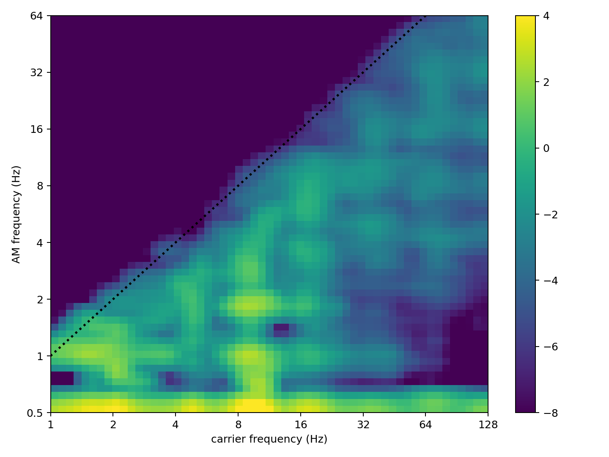
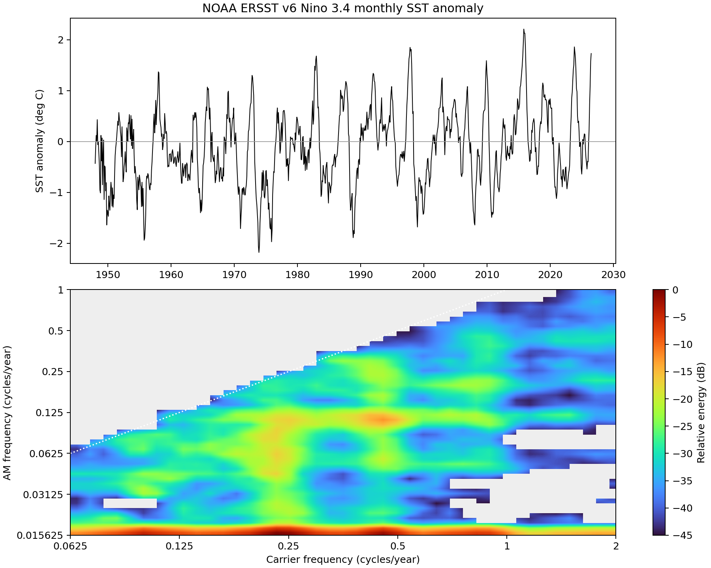

# HHSA-Python: Holo-Hilbert Spectral Analysis for Nonlinear and Non-Stationary Time Series

[](https://doi.org/10.5281/zenodo.22884720)

HHSA-Python is an independent Python implementation of the two-layer
Holo-Hilbert Spectral Analysis (HHSA) workflow, based on the algorithmic
structure of the available MATLAB HHSA distribution and the methodology
described by Huang et al. (2016).

The implementation reproduces the major computational stages of the MATLAB
workflow, including empirical mode decomposition (EMD), masking,
instantaneous amplitude and frequency estimation, second-layer amplitude
decomposition, and Holo-Hilbert spectral projection.

No third-party Python EMD package is required for the core decomposition.
Academic, non-commercial use only. See [LICENSE](LICENSE).

<p align="center">
  
</p>

<p align="center">
  <b>Holo-Hilbert spectral analysis in Python.</b><br>
  Two-layer decomposition resolves both carrier-frequency and
  amplitude-modulation-frequency structures.
</p>

---

## Implementation relationship to the original MATLAB workflow

The relationship between the available original MATLAB HHSA workflow and this
Python implementation is:

```text
Original HHSA MATLAB workflow
          │
          ├── neurohhsa_ex1.m
          │
          ├── emdx.m  ← source available
          │      │
          │      └── rcada_emd MEX
          │               ↑
          │          source NOT available
          │
          ↓
Our hhsa-python
          │
          ├── Python HHSA workflow
          │
          └── src/hhsa/emd.py
                ↑
        Python reimplementation
        based on available MATLAB
        algorithm/workflow
```

This distinction is important for reproducibility.

The scientific methodology follows the Empirical Mode Decomposition (EMD),
Hilbert-Huang Transform (HHT), and Holo-Hilbert Spectral Analysis (HHSA)
framework developed by Huang and co-authors.

The Python implementation follows the algorithmic structure exposed by the
available MATLAB HHSA workflow.

The original distribution provides the lower-level `rcada_emd` implementation
only as compiled MEX binaries. Its underlying source code is not available in
the distribution used for this project.

Therefore, `src/hhsa/emd.py` is an independent Python reimplementation based
on the available MATLAB algorithm/workflow, including `emdx.m`, rather than a
line-by-line translation of the unavailable `rcada_emd` source code.

Numerical or bit-for-bit identity with the original compiled MEX
implementation is **not claimed**.

---

## Quick start on Gadi

Run all verified examples with one command:

```bash
cd /g/data/p66/ars599/HHSA_WK/hhsa-python
./run_example.sh
```

The script loads:

```text
conda/analysis3-26.01
```

sets `PYTHONPATH`, runs the test suite, and then runs:

1. a known 20 Hz carrier / 2 Hz AM validation signal;
2. the bundled `hhsa_ex1_data.mat` example; and
3. the NOAA monthly Niño3.4 climate-index example.

Generated files include:

```text
outputs/simple_am_hhsa.png
outputs/HHS_ex1_python.png
outputs/HHS_ex1_python.mat
outputs/nino34_hhsa.png
```

---

# Synthetic AM Validation

A simple amplitude-modulated signal provides a controlled validation of the
two-layer HHSA implementation.

The validation signal is

```text
x(t) = [1 + 0.7 cos(2π 2t)] cos(2π 20t)
```

with

```text
sample rate = 200 Hz
duration    = 8 seconds
carrier     = 20 Hz
AM          = 2 Hz
```

Run:

```bash
PYTHONPATH=src python examples/simple_am_example.py
```

Verified output:

```text
Expected carrier:    20.000 Hz
Detected carrier:    19.870 Hz

Expected modulation:  2.000 Hz
Detected modulation:  2.000 Hz

Absolute errors:
carrier = 0.130 Hz
AM      = 0.000 Hz
```

The script exits unsuccessfully if the detected carrier or AM peak lies
outside the configured tolerance.

## Synthetic AM Holo-Hilbert spectrum

<p align="center">
  
</p>

<p align="center">
  <b>Figure 1.</b> HHSA of a synthetic amplitude-modulated signal.
  The imposed 20 Hz carrier and 2 Hz amplitude modulation are recovered
  by the Python implementation.
</p>

This experiment provides a directly interpretable validation that the
two-layer decomposition can recover a known carrier frequency and its imposed
amplitude-modulation frequency.

---

# Bundled HHSA Example

The bundled file

```text
data/hhsa_ex1_data.mat
```

contains variable `data`: 5,501 samples at 1,000 Hz.

MATLAB samples

```text
501:2500
```

correspond to Python samples

```text
500:2500
```

because Python uses zero-based indexing.

Run:

```bash
PYTHONPATH=src python -m hhsa.cli \
    --max-imfs 8 \
    --max-modulation-imfs 6
```

The MAT output contains:

```text
IMF
IMF2
fm
am
FM
AM
All_nt
```

for comparison with the MATLAB workflow.

## Holo-Hilbert spectrum

<p align="center">
  
</p>

<p align="center">
  <b>Figure 2.</b> Holo-Hilbert spectral representation produced by
  HHSA-Python for the bundled HHSA example.
</p>

---

# Niño3.4 Climate Example

The repository also includes an application of HHSA to the NOAA monthly
Niño3.4 climate index.

Data source:

**NOAA PSL monthly Niño3.4 ERSST v6 SST anomaly index**

```text
Region:        5°N–5°S, 170°W–120°W
Variable:      SST anomaly
Units:         °C
Sampling rate: 12 samples/year
```

The converted data currently included in the repository cover:

```text
1948-01 through 2026-07
```

Refresh the official data using:

```bash
python scripts/prepare_nino34.py --download
```

Run the HHSA example:

```bash
PYTHONPATH=src python examples/nino34_example.py
```

## Application to Niño3.4

<p align="center">
  
</p>

<p align="center">
  <b>Figure 3.</b> Application of HHSA-Python to the NOAA monthly
  Niño3.4 SST anomaly index, illustrating carrier-frequency and
  amplitude-modulation-frequency variability in a climate time series.
</p>

This example demonstrates application of the same two-layer HHSA framework
used in the synthetic experiment to a real climate time series.

---

This example demonstrates application of the same two-layer HHSA framework
used in the synthetic experiment to a real climate time series.

---

## Related HHSA Climate Applications

The HHSA-Python framework has been further applied to climate-index
prediction experiments combining HHSA-derived features with neural-network
approaches.

### Niño3.4 / ENSO Forecast Experiment

[**HHSA-Sohail Niño3.4 Forecast Experiment**](https://github.com/arnoldsu/hhsa_sohail_n34)

This project applies HHSA-derived information to Niño3.4 prediction and
investigates whether ENSO event timing and event strength can be modeled
separately using neural networks.

### Pacific Meridional Mode (PMM) Forecast Experiment

[**HHSA-Sohail Pacific Meridional Mode Forecast Experiment**](https://github.com/arnoldsu/hhsa_sohail_pmm)

This project extends the HHSA-Sohail framework to the Pacific Meridional
Mode (PMM), including PMM SST and wind components.

### Relationship between the repositories

```text
                    HHSA methodology
                    Huang et al.
                         │
                         ▼
                    HHSA-Python
                         │
              ┌──────────┴──────────┐
              │                     │
              ▼                     ▼
       Niño3.4 / ENSO              PMM
       HHSA + NN                HHSA + NN
              │                     │
              ▼                     ▼
     hhsa_sohail_n34        hhsa_sohail_pmm

# Method Overview

The first EMD level decomposes a signal into intrinsic mode functions (IMFs):

```text
x(t) = Σ IMF_i(t) + r(t)
```

Each oscillatory component can be represented as

```text
IMF_i(t) = A_i(t) cos[φ_i(t)]
```

where

```text
A_i(t)
```

is the instantaneous amplitude and

```text
φ_i(t)
```

is the instantaneous phase.

The corresponding instantaneous frequency is

```text
f_i(t) = (1 / 2π) dφ_i(t)/dt.
```

HHSA extends this representation by decomposing the amplitude modulation
`A_i(t)` itself:

```text
A_i(t) = Σ AMIMF_ij(t) + r_i^AM(t).
```

This introduces an additional modulation-frequency dimension.

Conceptually:

```text
Original signal x(t)
        │
        ▼
First-level EMD
        │
        ├── IMF1
        ├── IMF2
        ├── ...
        └── residual
        │
        ▼
Instantaneous analysis
        │
        ├── amplitude A(t)
        ├── phase φ(t)
        └── frequency f(t)
        │
        ▼
Second-level EMD of A(t)
        │
        ├── AM-IMF1
        ├── AM-IMF2
        ├── ...
        └── AM residual
        │
        ▼
Holo-Hilbert spectrum
        │
        ├── carrier frequency
        └── modulation frequency
```

The Holo-Hilbert representation therefore describes both the oscillatory
carrier and the slower modulation acting on that oscillation.

---

# Python API

A minimal example is:

```python
from scipy.io import loadmat
from hhsa import decompose, project

signal = loadmat(
    "data/hhsa_ex1_data.mat"
)["data"].squeeze()

result = decompose(
    signal,
    sample_rate=1000,
)

spectrum = project(
    result,
    start=500,
    stop=2500,
    time_bins=500,
)
```

The decomposition provides the quantities required for the two-layer HHSA
analysis, while `project` constructs the corresponding spectral
representation.

---

# Tests

Run:

```bash
PYTHONPATH=src python -m pytest -q
```

Current verified result:

```text
3 passed
```

---

# Repository Structure

```text
hhsa-python/
│
├── data/
│
├── docs/
│   └── images/
│
├── examples/
│   ├── simple_am_example.py
│   └── nino34_example.py
│
├── outputs/
│   ├── simple_am_hhsa.png
│   ├── HHS_ex1_python.png
│   ├── HHS_ex1_python.mat
│   └── nino34_hhsa.png
│
├── scripts/
│   └── prepare_nino34.py
│
├── src/
│   └── hhsa/
│       ├── emd.py
│       ├── instantaneous.py
│       ├── core.py
│       ├── spectrum.py
│       └── cli.py
│
├── tests/
│
├── run_example.sh
├── pyproject.toml
├── CITATION.cff
├── LICENSE
└── README.md
```

---

# Implementation Provenance and Reproducibility

HHSA-Python is an independent Python implementation of the available
two-layer HHSA MATLAB workflow.

The implementation follows the algorithmic structure exposed by the
distributed MATLAB scripts, including:

- masking phases;
- iterative EMD sifting;
- spline resampling;
- PCHIP normalization;
- direct quadrature;
- MATLAB-style rounding and index mapping;
- spectral collapse;
- energy weighting; and
- two-stage smoothing.

A limitation of exact reproduction is that the original distribution provides
the lowest-level `rcada_emd` routine only as platform-specific compiled MEX
binaries.

The corresponding C/C++/MATLAB source code is not available in the
distribution used for this project.

The implementation relationship is therefore:

```text
Original HHSA MATLAB workflow
          │
          ├── neurohhsa_ex1.m
          │
          ├── emdx.m  ← source available
          │      │
          │      └── rcada_emd MEX
          │               ↑
          │          source NOT available
          │
          ↓
Our hhsa-python
          │
          ├── Python HHSA workflow
          │
          └── src/hhsa/emd.py
                ↑
        Python reimplementation
        based on available MATLAB
        algorithm/workflow
```

Therefore, the EMD implementation in this repository reconstructs the
available algorithmic behaviour from the supplied MATLAB workflow, including
`emdx.m`, rather than translating unavailable `rcada_emd` source code.

The implementation is deterministic and reconstructs the input from its
decomposed components.

However, numerical or bit-for-bit identity with the original compiled MEX
implementation is **not claimed**.

For studies requiring direct reproduction of results generated by the
original MATLAB/MEX software, intermediate arrays should be compared against a
working installation of the original software.

---

# Plot Quality and Colour Scaling

HHSA spectra are sparse: most frequency bins contain exactly zero energy while
a relatively small number contain strong spectral peaks.

Plotting `log(energy)` directly can therefore cause zero-energy bins and the
strongest peaks to dominate the colour scale.

The AM and Niño3.4 examples instead use relative decibels:

```python
smoothed = gaussian_filter(power, sigma=1.0)

relative_db = 10 * np.log10(
    np.maximum(
        smoothed / smoothed.max(),
        1e-6
    )
)

relative_db = np.ma.masked_less(
    relative_db,
    -45
)

image = ax.imshow(
    relative_db,
    origin="lower",
    aspect="auto",
    cmap="turbo",
    vmin=-45,
    vmax=0,
    interpolation="bilinear",
)

ax.set_facecolor("#eeeeee")

fig.colorbar(
    image,
    ax=ax,
    label="Relative energy (dB)"
)
```

This visualization approach has several advantages:

1. the strongest spectral energy is always 0 dB;
2. energy down to -45 dB remains visible on a consistent scale;
3. values below -45 dB are masked instead of becoming a uniform low-value
   colour; and
4. Gaussian smoothing and bilinear display reduce visible block boundaries
   without changing the underlying HHSA arrays or detected peak frequencies.

The numerical spectrum remains in linear energy units.

Decibel conversion, masking, Gaussian smoothing, and interpolation are used
only for visualization.

To show a wider dynamic range, change the threshold from

```text
-45 dB
```

to

```text
-60 dB
```

To emphasize only the strongest features, use approximately

```text
-30 dB
```

Increasing `bins_per_octave` changes the frequency resolution and computation
size; it does not by itself correct poor colour normalization.

---

# Scientific Attribution

The scientific methodology implemented by this package is based on the
Empirical Mode Decomposition, Hilbert-Huang Transform, and Holo-Hilbert
Spectral Analysis framework developed by Huang and co-authors.

The relationship should therefore be interpreted as:

```text
Huang et al.
    │
    ├── EMD / Hilbert-Huang methodology
    │
    └── Holo-Hilbert Spectral Analysis methodology
              │
              ▼
Available MATLAB HHSA workflow
              │
              ▼
HHSA-Python
Independent Python implementation
Arnold Sullivan
```

HHSA-Python does **not** claim authorship of the underlying EMD, HHT, or HHSA
methodologies.

The contribution of this repository is the independent Python implementation,
testing, validation, examples, Python API, command-line workflow, climate-data
application, and reproducible software packaging.

---

# Citation

If you use **HHSA-Python** in research, please cite the archived software
release:

> **Sullivan, Arnold. (2026).  
> HHSA-Python: Holo-Hilbert Spectral Analysis for Nonlinear and Non-Stationary
> Time Series. Zenodo.  
> DOI: 10.5281/zenodo.22884720**

[](https://doi.org/10.5281/zenodo.22884720)

The methodological papers by Huang and co-authors should also be cited as
appropriate.

---

# References

The theoretical basis of this package follows the Empirical Mode
Decomposition (EMD), Hilbert-Huang Transform (HHT), and Holo-Hilbert Spectral
Analysis (HHSA) framework developed by Huang and co-authors.

### Holo-Hilbert Spectral Analysis

Huang, N. E., Hu, K., Yang, A. C. C., Chang, H.-C., Jia, D.,
Liang, W.-K., Yeh, J. R., Kao, C.-L., Juan, C.-H., Peng, C. K.,
Meijer, J. H., Wang, Y.-H., Long, S. R., & Wu, Z. (2016).

**On Holo-Hilbert spectral analysis: a full informational spectral
representation for nonlinear and non-stationary data.**

*Philosophical Transactions of the Royal Society A*, **374**(2065),
20150206.

DOI: https://doi.org/10.1098/rsta.2015.0206

### Empirical Mode Decomposition and Hilbert Spectrum

Huang, N. E., Shen, Z., Long, S. R., Wu, M. L. C., Shih, H. H.,
Zheng, Q., Yen, N.-C., Tung, C. C., & Liu, H. H. (1998).

**The empirical mode decomposition and the Hilbert spectrum for nonlinear
and non-stationary time series analysis.**

*Proceedings of the Royal Society A*, **454**(1971), 903–995.

DOI: https://doi.org/10.1098/rspa.1998.0193

### EMD and Hilbert Spectral Confidence Limits

Huang, N. E., Wu, M. L. C., Long, S. R., Shen, S. S. P., Qu, W.,
Gloersen, P., & Fan, K. L. (2003).

**A confidence limit for the empirical mode decomposition and Hilbert
spectral analysis.**

*Proceedings of the Royal Society A*, **459**(2037), 2317–2345.

DOI: https://doi.org/10.1098/rspa.2003.1123

---

# Software Information

**Software:** HHSA-Python  
**Version:** 1.0.0  
**Author:** Arnold Sullivan  
**ORCID:** https://orcid.org/0000-0002-5712-6195  
**DOI:** https://doi.org/10.5281/zenodo.22884720  
**Repository:** https://github.com/arnoldsu/hhsa-python

---

## DOI

[](https://doi.org/10.5281/zenodo.22884720)

**10.5281/zenodo.22884720**
