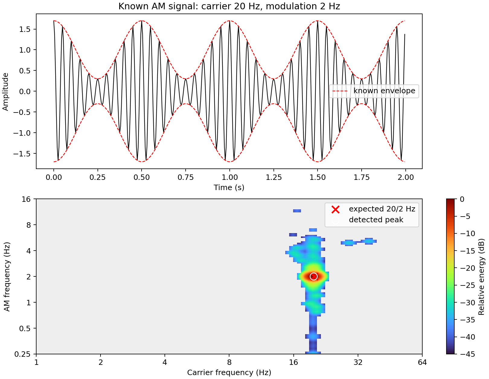

# HHSA Python

# HHSA-Python: Holo-Hilbert Spectral Analysis for Nonlinear and Non-Stationary Time Series

[](https://doi.org/10.5281/zenodo.22884720)
Python translation of the standalone two-layer Hilbert-Huang Spectral Analysis
(HHSA) workflow in `neurohhsa_ex1.m`.

Academic, non-commercial use only. See [LICENSE](LICENSE).

## Quick start on Gadi

Run all verified examples with one command:

```bash
cd /g/data/p66/ars599/HHSA_WK/hhsa-python
./run_example.sh
```

The script loads `conda/analysis3-26.01`, sets `PYTHONPATH`, runs the test
suite, and then runs:

1. A known 20 Hz carrier / 2 Hz AM validation signal.
2. The bundled `hhsa_ex1_data.mat` example.
3. The NOAA monthly Nino 3.4 climate-index example.

Generated files:

```text
outputs/simple_am_hhsa.png
outputs/HHS_ex1_python.png
outputs/HHS_ex1_python.mat
outputs/nino34_hhsa.png
```

## Synthetic AM validation

The validation signal is:

```text
x(t) = [1 + 0.7 cos(2 pi 2t)] cos(2 pi 20t)
sample rate = 200 Hz
duration = 8 seconds
```

Run it separately:

```bash
PYTHONPATH=src python examples/simple_am_example.py
```

Verified output:

```text
Expected carrier:    20.000 Hz
Detected carrier:    19.870 Hz
Expected modulation:  2.000 Hz
Detected modulation:  2.000 Hz
Absolute errors: carrier=0.130 Hz, AM=0.000 Hz
```



The script exits unsuccessfully if the detected carrier or AM peak lies outside
the configured tolerance.

## Bundled HHSA example

The bundled file `data/hhsa_ex1_data.mat` contains variable `data`: 5,501
samples at 1,000 Hz. MATLAB samples `501:2500` correspond to Python samples
`500:2500`.

```bash
PYTHONPATH=src python -m hhsa.cli \
    --max-imfs 8 \
    --max-modulation-imfs 6
```

The MAT output contains `IMF`, `IMF2`, `fm`, `am`, `FM`, `AM`, and
`All_nt` for comparison with MATLAB.

## Nino 3.4 example

Data source: NOAA PSL monthly Nino 3.4 ERSST v6 SST anomaly index.

- Region: 5N-5S, 170W-120W
- Units: degrees C
- Sampling rate: 12 samples/year
- Available converted values: 1948-01 through 2026-07

Refresh the official data:

```bash
python scripts/prepare_nino34.py --download
```

Run the example:

```bash
PYTHONPATH=src python examples/nino34_example.py
```

## Tests

```bash
PYTHONPATH=src python -m pytest -q
```

Current result:

```text
3 passed
```

## Repository structure

```text
hhsa-python/
|-- data/
|-- docs/images/
|-- examples/
|   |-- simple_am_example.py
|   `-- nino34_example.py
|-- scripts/prepare_nino34.py
|-- src/hhsa/
|   |-- emd.py
|   |-- instantaneous.py
|   |-- core.py
|   |-- spectrum.py
|   `-- cli.py
|-- tests/
|-- run_example.sh
|-- pyproject.toml
`-- README.md
```

## Python API

```python
from scipy.io import loadmat
from hhsa import decompose, project

signal = loadmat("data/hhsa_ex1_data.mat")["data"].squeeze()
result = decompose(signal, sample_rate=1000)
spectrum = project(result, start=500, stop=2500, time_bins=500)
```

## Reproducibility note

The conversion preserves masking phases, the ten-sift EMD structure, spline
resampling, PCHIP normalization, direct quadrature, MATLAB rounding and index
mapping, spectral collapse, energy weights, and two-stage smoothing.

The original distribution provides its lowest-level `rcada_emd` only as
platform-specific compiled MEX files, without C/C++/MATLAB source. This package
therefore ports the supplied `emdx.m` at that boundary. It is deterministic
and reconstructs the input exactly, but bit-for-bit agreement with the
proprietary MEX must not be claimed. Validate saved intermediate arrays against
a working MATLAB installation before publication.

## Plot quality and color scaling

HHSA spectra are sparse: most frequency bins contain exactly zero energy while
a small number contain strong peaks. Plotting `log(energy)` directly maps zero
to a very large negative number. The colour scale is then controlled by zeros
and the strongest peak, which can make the image look like two flat yellow and
purple regions.

The AM and Nino 3.4 examples use relative decibels instead:

```python
smoothed = gaussian_filter(power, sigma=1.0)
relative_db = 10 * np.log10(
    np.maximum(smoothed / smoothed.max(), 1e-6)
)
relative_db = np.ma.masked_less(relative_db, -45)

image = ax.imshow(
    relative_db,
    origin="lower",
    aspect="auto",
    cmap="turbo",
    vmin=-45,
    vmax=0,
    interpolation="bilinear",
)
ax.set_facecolor("#eeeeee")
fig.colorbar(image, ax=ax, label="Relative energy (dB)")
```

This improves the plot in four ways:

1. The strongest spectral energy is always 0 dB.
2. Energy down to -45 dB remains visible with a consistent colour scale.
3. Values below -45 dB are masked instead of becoming a solid low-value colour.
4. Gaussian smoothing and bilinear display reduce block boundaries without
   changing the underlying HHSA arrays or detected peak frequencies.

The numerical spectrum remains in linear energy units. Decibel conversion,
masking, and interpolation are used only for visualization.

To show a wider dynamic range, change both `-45` values to `-60`. To show
only the strongest features, use `-30`. Increasing `bins_per_octave` changes
frequency resolution and computation size; it does not by itself fix poor colour
normalization. The synthetic AM example uses 16 bins per octave and detects
19.870 Hz carrier / 2.000 Hz modulation for the expected 20 Hz / 2 Hz signal.

## References

The theoretical basis of this package follows the Hilbert-Huang
Transform (HHT) and Holo-Hilbert Spectral Analysis (HHSA) framework.

1. Huang, N. E., Hu, K., Yang, A. C. C., Chang, H.-C., Jia, D.,
   Liang, W.-K., Yeh, J. R., Kao, C.-L., Juan, C.-H., Peng, C. K.,
   Meijer, J. H., Wang, Y.-H., Long, S. R., & Wu, Z. (2016).
   **On Holo-Hilbert spectral analysis: a full informational spectral
   representation for nonlinear and non-stationary data.**
   *Philosophical Transactions of the Royal Society A*, 374(2065),
   20150206.
   https://doi.org/10.1098/rsta.2015.0206

2. Huang, N. E., Shen, Z., Long, S. R., Wu, M. L. C., Shih, H. H.,
   Zheng, Q., Yen, N.-C., Tung, C. C., & Liu, H. H. (1998).
   **The empirical mode decomposition and the Hilbert spectrum for
   nonlinear and non-stationary time series analysis.**
   *Proceedings of the Royal Society A*, 454(1971), 903–995.
   https://doi.org/10.1098/rspa.1998.0193

3. Huang, N. E., Wu, M. L. C., Long, S. R., Shen, S. S. P.,
   Qu, W., Gloersen, P., & Fan, K. L. (2003).
   **A confidence limit for the empirical mode decomposition and
   Hilbert spectral analysis.**
   *Proceedings of the Royal Society A*, 459(2037), 2317–2345.
   https://doi.org/10.1098/rspa.2003.1123
